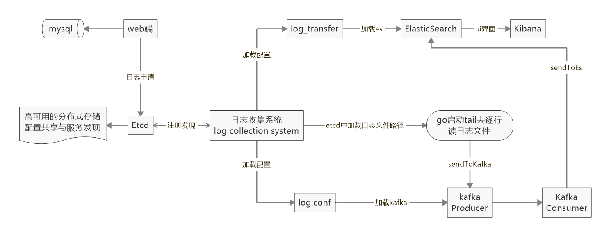

# gologcollection
Golang log collection【Go实现日志tail】

### 初衷是想达到一个日志收集-读日志-发送到es这样一个过程

1.日志收集的路径初步设定死是在某个路径下，如果想修改收集的日志还需停了程序修改后再起
2.添加etcd模块，目的就是类似于zookeeper吧，做一个服务发现和注册的功能，针对某台机器，设定一个对应的key，将要收集的日志路径写到对应的value中
  再起一个watch去监听每个key下面的配置变化，若有改变则监听到之后修改，这样不必手动调整
3.添加消息中间件kafka，因为直接读日志发到es有点单一，而且没有一个中间件做负载也不太安全，可能会造成数据丢失，所以中间用kafka做了一个消息中介，
  读到日志后实时发送给kafka，kafka拿到数据给es消费
4.kibana做es的web界面展示，提供了便捷的关键字查询功能，很方便
5.写了web界面用来配置项目信息和日志的信息【日志信息即etcd设置的value 即要收集的日志的路径】

### flow chart

### technology
Golang,etcd,kafka,ElasticSearch,kibana,nginx

### error

开发中有些坑要填一下

1. go的一些包被墙的有点厉害，建议是有个VPN再去 go get 这样会很舒服
尤其是 golang.org/x/ 下的包 不FQ下不来很头疼
2. etcd安装和启动很简单
安装：去 https://github.com/etcd-io/etcd/releases 找对应你的操作系统的安装包去下载即可
启动：bin/etcd.exe
想测试etcd 的key-value可以去找下栗子比较简单
针对etcd简单介绍一下：我对它的理解就是分布式key-value存储，官方说是高可用的分布式这个还没体验到，之后慢慢探索，用于配置共享和服务发现(服务注册吧)，这个有点类似zookeeper，通过key来 Get 到value就好了
3. kafka这块有个坑吧 gokrb5.v7这个包不是太好下 我直接上传了直接下载就行
https://github.com/Shopify/sarama 用的是这个go写的kafka的库 和java的操作类似，也好懂，找个栗子看看就懂了，无非就是加载配置和sendMessage()
4. ElasticSearch 这个应该都有用过，提一下如果要配置对应的kibana界面的话，二者的版本号要对应
配置文件修改几处：
1.elasticsearch-7.2.0-windows-x86_64 (1)\elasticsearch-7.2.0\config\elasticsearch.yml  中的  network.host: 127.0.0.1 //本地就设置本地的，服务器就设置服务器的
因为es可以上集群，我这里没做集群，只要kafka做了集群
es的默认端口是localhost:9200
2.kibana 配置只要 把es的配置写进去就好，如下：
elasticsearch.hosts: ["http://localhost:9200"]

### 启动时：
生产者在mian下的两个go文件，一起启动
消费者在log_transfer下的两个go文件同样一起启动
我用的是goland 用ctrl点住两个文件一起run就行
如果用cmd的话 就一起 go build 一下，用.exe文件启动

